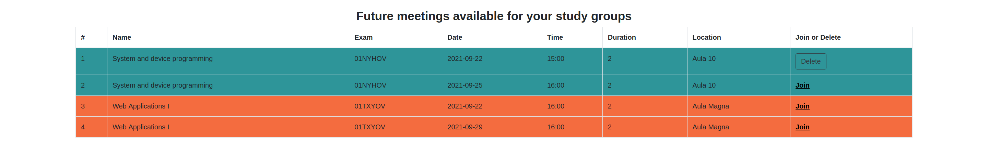

# Exam #3: "Study Groups"
## Student: s284590 Di Franco Francesco

## React Client Application Routes

- Route `/`: Login Page or Student Page. Here the student can open the page relating the study group. Also, the student can see the meetings he's register for and future  meetings  for  all  joined  study  groups 
- Route `/studygroups/:codeExam`: Page related to the selected study group. Student can join to the meetings of studygroup. Admin and group administrator can find all the tools needed to perform the managment functions.
  

## API Server

- POST `/api/login`
  - Credential used to perform a login: username and password
  - Object "User": Name, username, id, Group Admin, General Admin
- DELETE `/api/sessions/current`
  - Perform a Logout
  - Result of the logout
- POST `/api/sessions/current`
  - Check if the user is logged or not
  - Object "User": Name, username, id, Group Admin, General Admin
- GET `/api/studygroup`
  - Retrieve all study groups
  - Array with all studygroups: [{exam,name,credits,color},{...}] 
- GET `/api/studygroup/:id`
  - Retrieve all study groups joined by the logged user. Param: user.id
  - Array with the joined studygroups: [{exam,name,credits,color},{...}] 
- POST  `/api/studygroup/ask`
  - Insert in to the Pending Ask Table the request of the logged user to join in a studygroup Param: user.id, studygroup.exam
  - Result of the request
- GET `/api/studygroup/managed/:id`
  - Retrieve all the studygroups managed by the logged user. Param user.id
  - Array with the managed studygroups: [{exam,name,credits,color},{...}] 
- GET `/api/studygroup/ls/:exam`
   -  Retrieve all the students joined in a study group Param: studygroup.exam
   -  Array with all the joined student [{user.id,user.name,user.username}{...}]
- POST `/api/exam/meeting` 
  - Insert in to the meeting table the new meeting. Param: Meeting object [date,time,duration,location,exam]
  - Result of the request
- GET `/api/asktojoin/:exam`
  - Retrieve all the request to join a studygroup of a specific exam. Param: exam
  - Array with all the waiting student [{user.id,user.name,user.username}{...}]
- POST `/api/studygroup/resultask`
  - Insert into the StudyGroup_User table the new student. Accept a student request. Param: user.id, exam
  - Result of the request
- DELETE `/api/pendingask`
  - Delete the pending request. Param: userid,exam
  - Result of the request
- DELETE `/api/pendingask`
  - Delete a student from a studygroup. Param: userid, exam
  - Result of the request
- GET `/api/meetinglist/exam/:exam`
  - Retrieve all the meeting of a specific study group. Param: exam
  - Array with all meetings of a specific stufy group [{id,date,time,duration,location,exam},{...}]
- POST `/api/meeting/join`
  - Insert in the Meeting_User table the attendance of a specific meeting Param: user.id,meeting.id,exam
  - Result of the request
- GET `/api/meetinglist/id/:id`
  - Retrieve all the meeting booked of the logged user Param:user.id
  - Array with all meeting of a specific user  [{id,date,time,duration,location,exam},{...}]
- DELETE `api/deletesignupmeetlist`
  - Delete the signup for a meeting Param: user.id, meetings.id
  - Result of the request
- PUT `api/studygroup/promoveAdmin`
  - Update the User table. Change User.GroupAdmin from 0 to 1 in order to consider the student as group admin Param: user.id
  - Result of the update
- POST `api/studygroup/promoveAdmin`
  - Insert in to GroupAdminstrator_Exam the new admin. Param: user.id, exam
  - Result of the request
- DELETE `api/removeGroupAdmin`
  - Delete in GroupAdminstrator_Exam table an admin. Param: user.id,exam
  - result of the request
- PUT `api/groupadmin0`
  - Update the User table. Change User.GroupAdmin from 1 to 0 in order to not consider anymore the student as group admin. Param: user.id
  - Result of the request
- GET `api/studygroup/admin/:exam`
  - Retrive the list of the admin of a specific studygroup Param: exam
  - Array with all the admin of a specific studygroup  [{user.id,user.name,user.username}{...}]
- POST `api/studygroup/new`
  - Insert in to Studygroup table the new studygroup. Param:{studygroup.name,code,credits,color}
  - Result of the request
- DELETE `api/studygroup` Param:exam 
  - Delete a studygroup table the studygroup selected. Param: exam
  - Result of the request
- DELETE  `api/studygroup/admin`
  - Delete all the admin of a specific studygroup. Param:exam
  - result of the request
- DELETE `api/studygroup/users`
  - Delete all the user of a specific studygroup Param:exam
  - result of the request
- GET `api/meetinglistjoined/id/:id`
  - Retrieve all the meeting available for the study groups joined by the user Param:user.id
  - Array with all meeting available for the study group joined [{meeting.id,date,time,duration,location,studygroup.exam,studygroup.name,studygroup.color},{...}]
- DELETE `api/meetings`
  - Delete from Meetings table all the meeting of a specific exam Param:exam
  - Result of the request
- DELETE `api/meetingsUser`
  - Delete from Meetings_User all the meeting-user of a specific exam Param:exam
  - Result of the request
- DELETE `api/meetlist`
  - Delete  from Meetings_user all the meeting of a specific user and exam Param:exam, user.id
  - Result of the request

## Database Tables

- Table `User` - contains User.id,User.name,User.Username,User.Password,User.General_Admin, User.Group_Admin
General_Admin and Group_Admin are two binary value (0,1). 
- Table `StudyGroup` - contains Exam, Name, Credits, Color
- Table `StudyGroup_User` contains Exam,User_Id. It is the joining table of User and Studygroup. 
- Table `PendingAskStudyGroup` contains Exam and Id. It is the table where the request to join in a studygroup are recorded. When a Admin accepts or refuses a request, it will be deleted.
- Table `Meetings` contains Meetings_Id, Exam,Date,Time,Duration,Location
- Table `Meetings_User` contains User_Id,Meetings_Id,Exam. It is the joining table of User and Meetings
- Table `GroupAdministrator_Exam` contains User_Id,Exam. All the user placed here are admin of a specific study group.

## Main React Components

- `StudentDashboard` (in `StudentDashboard.js`): First Main component used to create a dashboard for the student. It includes several component
- `CardStudyGroup` (in `CardStudyGroup.js`): Component that renders the studygroup cards at the top of the page. It receives the list of study group and the Component maps them in a List of Card. The cards contain the Open button (in order to move to the specific study group page) and eventually the Ask to join and Remove buttons. Remove button appears only for the general admin. Ask to join button only for the not registered student.
- `MeetingListByStudent` (in `MeetingListByStudent.js`): This components includes two tables about meetings: Future meetings available for your study groups and Study group meetings to which you are registered
- `MyVerticallyCenteredModal` (in `MyVerticallyCenteredModal.js`): Modal used to create a new Studygroup by the general admin. it includes also an Alert that will be shown if the input data don't pass the validation.
- `StudyGroupsComp` (in `StudyGroupsComp.js`): Second main component used to render the studygroup page. For each studygroup, we have a different page where the study group code is passed as parameter in the link.
- `MeetingsPicker` (in `MeetingsPicker.js`): It contains the form used to create a new meeting for the specific study group. 
- `GetRequestJoinStudent` (in `GetRequestJoinStudent.js`): It contains a table with the pending request to join the studygroup
- `ListOfStudent` (in `ListOfStudent.js`): It contains two table: List of student and the list of the admin. With the specific button on the table, the admin che promove or remove an student.
- `MeetingListStudyGroup` (in `MeetingListStudyGroup.js`): It contains a table with all the meetings. The last field is a Join button, here the student can join a meeting.
- ...

(only _main_ components, minor ones may be skipped)

## Screenshot

## Users Credentials

- mucca, pazzoper User 1: General Administrator, Student
- pingu, lulic81 User 2: General Administrator, Group Administrator for Study Group A, Student
- compa, uaddan User 3: Group Administrator for Study Group A, Group Administrator for Study Group B, Student
- frank, frankuzz User 4: Group Administrator for Study Group B, Student
- girolvio, ciao123 User 5:  Student
  
